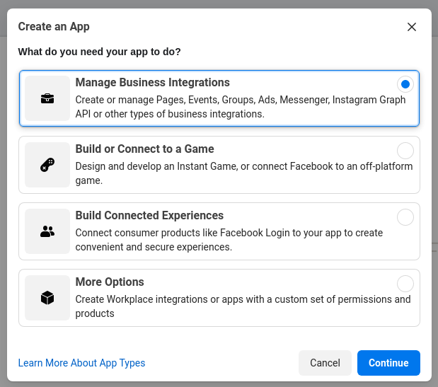
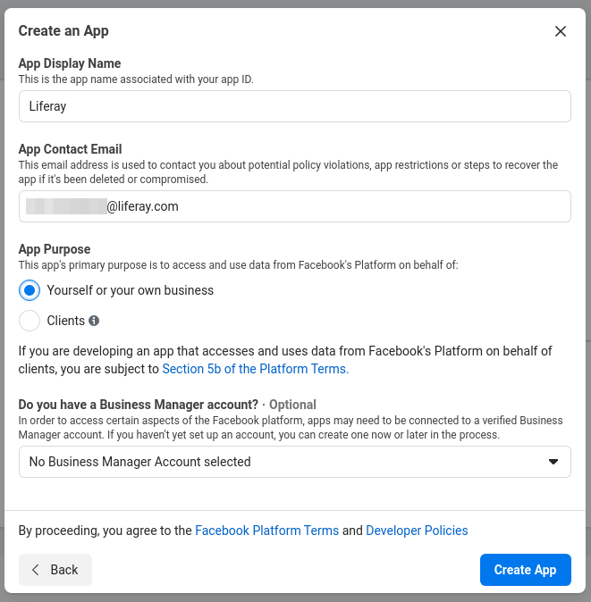

# Facebook
## Create Developer Account
developers.facebook.comx
## Create an App
Step 1


Step 2


## How to obtain long live page access token (valid for 60 days)
1. First obtain Short Lived User access token using https://developers.facebook.com/tools/explorer


1. Obtain Long Lived User Access token (valid for 60 days)
  ```
  curl --location --request GET 'https://graph.facebook.com/oauth/access_token?grant_type=fb_exchange_token&client_id=26...&client_secret=aceff...&fb_exchange_token=EAAlKZBQQI...'
  ```
tip: you can use Postman for this

3. Obtain Long Lived Page Access token (valid for 60 days)
```
curl --location --request GET 'https://graph.facebook.com/{PAGEID}}?fields=access_token&access_token=EAAlKZ...```
```

The last generated token is what you need in the System settings.